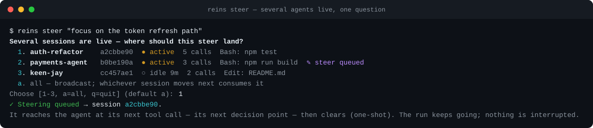
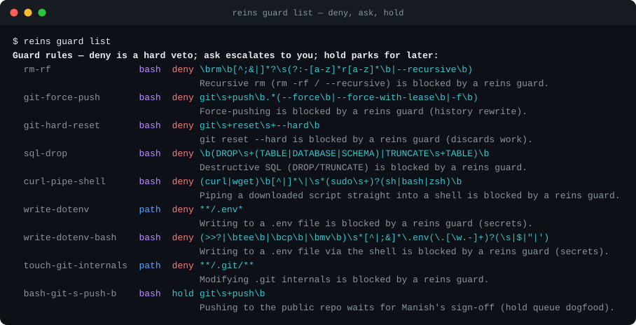
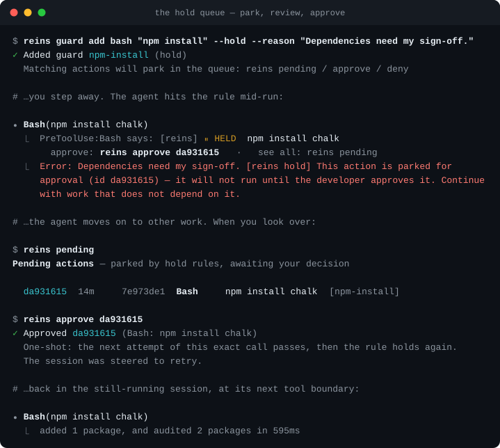

<div align="center">

# 🐎 reins

### Steer a running Claude Code agent without stopping it

Nudge it mid-run · block what it must never do · hold risky actions for your approval · see every agent on one screen

[](https://github.com/manishkumar/reins/actions/workflows/ci.yml)
[](LICENSE)
[](docs/compatibility.md)

[](#local-first)

**[Install](#install) · [First run](#first-run) · [What it does](#what-it-does) · [Before you rely on it](#before-you-rely-on-it) · [Commands](#command-reference)**

</div>

<p align="center">
  
</p>

<p align="center"><sub><code>reins watch</code> after an overnight run. Two actions are held for approval, one agent is looping, and the line that tripped the rule is lifted out of a nine-line command. Rendered by the cockpit's own renderer from a scripted scenario (<code>assets/cockpit-demo-frame.cjs</code>).</sub></p>

Local-first. No daemon, no backend, no account. Nothing leaves your machine.

---

## Why this exists

You are watching an agent work and you can see it drifting: editing the wrong module, over-building, about to run something destructive. Your options are to let it finish and clean up, or to end the run and lose its context.

reins adds a third option, built from Claude Code hooks:

| When | What | Hardness |
|---|---|---|
| Before a tool runs | **Guard**: deny a command or path, ask you at the prompt, or hold the action for later approval | Hard veto, or your call |
| During the run | **Steer**: add a one-line note the agent reads at its next tool call | Soft. The model weighs it |
| After each tool | **Loop alarm**: warn when the same call repeats in a row | Warn |
| When a turn ends | **Claim check**: compare "done" with the tests and builds the session ran | Report |
| Always | **Capture**: every run in a SQLite file you own | Observe |

```text
# terminal 1: the agent is mid-task and drifting
  ⏺ Edit(src/login/flow.ts)

# terminal 2: you, without ending the run
  $ reins steer "focus on the token refresh path, leave the login flow alone"
  ✓ queued — lands at the agent's next tool call

# terminal 1: next tool call, same run, context intact
  ⏺ [reins — live steering from the developer] folded in
  ⏺ Edit(src/auth/refresh.ts)
```

The story behind it: [*I Built a Tool to Steer Running AI Agents. It Taught Me Where Their Real Cost Is.*](https://medium.com/@manishky/i-built-a-tool-to-steer-running-ai-agents-it-taught-me-where-their-real-cost-is-fc617abfcb07)

---

## Install

```bash
npm install -g @manishky/reins
reins version
```

`npm install -g github:manishkumar/reins` works too. For a local checkout: `git clone`, then `npm install && npm run build && npm link`.

Requires Node ≥ 18. Capture needs SQLite, which is built in from Node 22.5. Steering, guards and holds work without it. See [compatibility](docs/compatibility.md).

## First run

```bash
cd your-project
reins init          # creates .reins/ and merges the hooks into .claude/settings.json
```

Restart Claude Code in the project so it loads the hooks. `reins init` merges into your settings and never overwrites them. `reins init --print` prints the block instead, and `reins init --local` writes to `settings.local.json`.

Then start any task in Claude Code, and from another terminal:

```bash
reins steer "keep the change minimal, and use the existing logger"
```

The agent reads it at its next tool call. Run `reins doctor` to check the setup: it reports the hooks, the Claude Code version, and whether a hook has run since the settings changed.

---

## What it does

### Steer

`reins steer "<message>"` queues a note for the next tool call. Two steers before that call both arrive. If the agent is already finishing and there is no next tool call, the Stop hook delivers the note, so a queued steer is not lost.

Treat a steer as the detail you forgot to put in the prompt. A steer that contradicts the prompt is weighed down by the model. For a hard "never do X", use a guard.

With several agents in one repo, `reins steer` asks which one you mean, or takes `--session <name>`.

<p align="center">
  
</p>

Details and caveats: [docs/steering.md](docs/steering.md).

### Guard

A guard matches a Bash command, a file path or a tool name before the call runs. It has three hardnesses:

```bash
reins guard add bash "psql.*production"       # deny: the call does not run
reins guard add bash "git push" --ask         # ask: Claude Code shows you its permission prompt
reins guard add bash "npm publish" --hold     # hold: park it for your later approval
reins guard add path "infra/**"               # block writes to paths
reins guard add tool "mcp__stripe__*" --ask   # match MCP tools by name
reins guard list
```

A deny holds under `--permission-mode bypassPermissions`. reins ships a default denylist: recursive `rm` outside build and scratch directories, force pushes, `git reset --hard`, `DROP`/`TRUNCATE`, `curl … | sh`, and writes to `.env*` and `.git/**`. `reins scan` proposes rules from your repo's own manifests, and `reins policy upgrade` refreshes shipped rules while keeping yours.

<p align="center">
  
</p>

Details, the measured false-positive rate, and `reins audit --guards`: [docs/guards.md](docs/guards.md).

### Hold: approval for the run nobody is watching

`--ask` needs you at the terminal. A hold rule parks the proposed action in a queue and lets the agent carry on with other work. The action does not run until you approve it.

```bash
reins pending                                 # what did the agents want to do?
#   ab12cd34  7h  3b9f2a1c  Bash  git push origin main  [bash-git-push]

reins approve ab12cd34                        # clears that exact call, once
reins deny ab12cd34 --steer "open a PR instead of pushing to main"
```

An approval is bound to one proposal: the same input, from the same session and directory, one time. A changed retry parks again.

<p align="center">
  
</p>

Transports, breach reporting and every caveat: [docs/holds.md](docs/holds.md).

### The cockpit: `reins watch`

One screen shows every agent in the repo and everything waiting on you. From it you approve or deny held actions and steer one agent or all of them. It is the control surface for unattended and headless runs and for several agents at once.

<p align="center">
  
</p>

<p align="center"><sub>A long-running agent, selected. The detail pane puts what it was asked beside what it edited and ran.</sub></p>

<p align="center">
  
</p>

<p align="center"><sub>Approving. The dialog shows the whole input, marks the line the rule matched, and keeps <code>y</code> locked until you have scrolled to the end.</sub></p>

- Looping agents are listed first, then agents with a held action, then the rest newest first.
- Approving in the cockpit runs the same code as `reins approve`. The action is re-read when you press `y`, and nothing is approved if it changed.
- The selection never moves on its own, so a new hold cannot slide under your cursor.
- Nothing listens on a port. `reins watch --once` prints a plain snapshot for scripts.

Keys, layout and caveats: [docs/watch.md](docs/watch.md).

### Loop alarm

When the agent runs the same tool with identical input three times in a row, reins adds a warning at that tool call and records the loop. Re-running `npm test` after each edit does not count; the same call with nothing in between does. `reins loops` lists the sessions, and `"loopThreshold"` in `.reins/config.json` tunes it.

### Claim check and footprint

When a turn ends, reins compares what the session did with its own tool calls:

```
[reins] Claim check: the last test run failed (npm test). reins lastrun lists the calls.
```

The verdicts are failed, stale (files edited after the last run), unverified (edits and no run), unknown (a run whose result reins cannot see) and verified. It reports and never blocks. The footprint lists what a session edited and ran beside the prompt it was given, and leaves the comparison to you.

What it can and cannot see: [docs/claim-check.md](docs/claim-check.md).

### Capture and the report

```bash
reins lastrun           # a readable account of the last run
reins sessions          # recent sessions, by title and name
reins audit             # every gate decision
reins report --open     # one self-contained HTML file, no network requests
```

Runs are stored in `.reins/runs.db`, three tables you can query with SQL. `REINS_NO_SQLITE=1` turns capture off; steering, guards and holds keep working.

More: [docs/capture.md](docs/capture.md).

### Inside Claude Code: the status mod (experimental)

`reins init --mod` installs a read-only Claude Code mod. `/reins` opens a pane beside the conversation with every hold and its full input. The status line shows the count. It has no approve button: approving stays in `reins approve` and `reins watch`.

Caveats: [docs/mods.md](docs/mods.md).

---

## Before you rely on it

These are the limits that decide whether reins fits your use. Each links to the full text.

- **Guards are speed bumps, not a sandbox.** They match the form of a command, not its intent. An agent blocked from `rm -rf foo` can delete another way. For a determined or adversarial agent, use OS-level sandboxing. [docs/guards.md](docs/guards.md)
- **Steering lands at the next tool call, and the model weighs it.** It is added spec, and it does not reverse the prompt. [docs/steering.md](docs/steering.md)
- **A hold uses deny-and-queue by default.** The `defer` transport is opt-in, because Claude Code honors it only in print mode and only for a solo tool call. A held action that ran anyway is reported as a HOLD BREACH after the fact. [docs/holds.md](docs/holds.md)
- **A crashing hook fails open.** A bug in reins never stops your agent, which also means a guard does not run if the hook itself errors. The hold gate is the exception: if parking fails, the call is denied.
- **Claude Code older than 2.0.56 loads no hooks from a settings file that names `PostToolUseFailure`.** `reins init` leaves that hook out unless it can confirm your version, and `reins doctor` tells you whether a hook has actually run. [docs/compatibility.md](docs/compatibility.md)
- **The claim check reads command text and exit status.** A passing run is the agent's own run. It does not mean the tests cover the change. [docs/claim-check.md](docs/claim-check.md)
- **The mod API is early access** and can change in any Claude Code release. [docs/mods.md](docs/mods.md)

---

## Local-first

reins makes zero network calls. No telemetry and no account. Your trajectories live in a SQLite file on your disk that you can read, query, back up or delete. The steering queue, the policy, the hold queue and the decisions are plain files under `.reins/`, so they work without the database.

## Security / threat model

**`.reins/steering.txt` is security-sensitive: write access to it equals steering access.** Anything that can write that file can inject context into your running agent at its next tool call. `reins` creates `.reins/` as `0700` (owner-only) and git-ignores it, but be deliberate:

- **Do not let an untrusted or automated writer feed it.** A CI job, a shared script, or any process you don't fully control writing to `.reins/steering.txt` is a hijack path into your agent. Treat write access to that file as you'd treat write access to your prompts.
- Steering is a **soft** channel — the model still weighs it and resists outright contradictions — so this is defense-in-depth, not a sole control. v1 ships no signing on the steering file; the mitigations are filesystem permissions (`0700`) and not pointing untrusted writers at it.
- **`.reins/decided/` is approval access.** One-shot hold decisions — approvals *and* refusals — are files there; anything that can write them can pre-approve (or fake-refuse) a parked action. Same posture, same mitigations.

Guards, separately, are **not** a containment boundary (see [what guards are and are not](docs/guards.md#what-guards-are--and-are-not)).

**A Claude Code mod runs above reins.** From Claude Code 2.1.287, a mod's `tool.call` hook runs before any `PreToolUse` command hook, reins included (measured in [docs/mods-probe.md](docs/mods-probe.md)). A mod can rewrite a command before reins reads it, in which case reins matches, parks and approves the rewritten command, the one that would run. A mod can also answer a tool call itself, and then no `PreToolUse` hook runs and reins sees nothing. A mod is code you installed in your own Claude Code, so this is the same trust as any other local code. reins does not detect it.

A crashing hook **fails open** (the agent proceeds) so a bug in `reins` can never wedge your agent — which also means guards are best-effort if the hook itself errors.

---

## Command reference

```text
reins init [--print|--local]     Set up .reins/ and wire (or print) the hooks
reins init --mod                 Also install the read-only status mod
reins init --failure-hook        Write PostToolUseFailure when the Claude Code
                                 version can't be read (needs 2.0.56+)
reins uninstall [--purge]        Remove the hooks (--purge also drops .reins/)
reins doctor                     Diagnose your setup
reins steer "<msg>" [--replace]  Queue steering for the next tool call (appends;
                                 several live agents + a TTY → a picker asks which)
reins steer "<msg>" --session <id|name>   Target one agent (id/prefix/name/mnemonic)
reins steer "<msg>" --broadcast  Skip the picker; whichever agent moves next gets it
reins steer [--clear]            Show / clear pending steering
reins name <session> "<label>"   Name a session; --clear reverts to the auto mnemonic
reins guard list|add|remove|reset    (add takes --ask to escalate, --hold to park)
reins scan [--accept]            Propose rules for what THIS repo can destroy
reins policy upgrade [--apply]   Refresh shipped rules, keeping yours and your edits
reins policy version             Your policy generation vs the shipped one
reins pending                    List actions parked by hold rules
reins approve <id>               Approve a parked action (one-shot, exact call)
reins deny <id> [--steer "..."]  Refuse a parked action, optionally steer instead
reins audit [session] [--json]   Every gate decision (deny/ask/hold/allow/breach/bypass)
reins audit --guards [--json]    Were the guards right? Every denial ever recorded,
                                 scored: stale rules, and vetoes worked around anyway
reins lastrun [session]          Readable account of a run (id prefix or name)
reins sessions [-n N]            List recent sessions (with names)
reins watch [-n SECS] [--once] [--quiet]  Cockpit: approve/deny holds, steer agents
reins report [--open] [-o FILE]  Self-contained local HTML report of all runs
reins loops                      Sessions where the agent looped
reins hook pre-tool|post-tool|post-tool-failure|stop   (invoked by Claude Code, not you)
```

## Documentation

| | |
|---|---|
| [Steering](docs/steering.md) | Delivery, the two caveats, several agents in one repo |
| [Guards](docs/guards.md) | Rules, `--ask`, the default denylist, what guards cannot do, `audit --guards`, `scan`, `policy upgrade` |
| [Holds](docs/holds.md) | The approval queue, transports, one-shot approvals, HOLD BREACH |
| [The cockpit](docs/watch.md) | `reins watch`: panes, keys, approving, narrow terminals |
| [Claim check and footprint](docs/claim-check.md) | Verdicts, and what the check can and cannot see |
| [Capture and the report](docs/capture.md) | `lastrun`, `sessions`, `report`, the SQLite schema |
| [The status mod](docs/mods.md) | The `/reins` pane inside Claude Code |
| [Compatibility](docs/compatibility.md) | Node versions, Claude Code versions, the `PostToolUseFailure` hook |
| [How it works](docs/how-it-works.md) | The hooks, the files under `.reins/`, testing a hook by hand |
| [SPEC.md](SPEC.md) | File formats and decision semantics, vendor-neutral |

## Contributing

See [CONTRIBUTING.md](CONTRIBUTING.md). Keep it small and sharp.

---

<div align="center">

MIT · no daemon, no backend, no account — just hooks, and files you own

</div>
