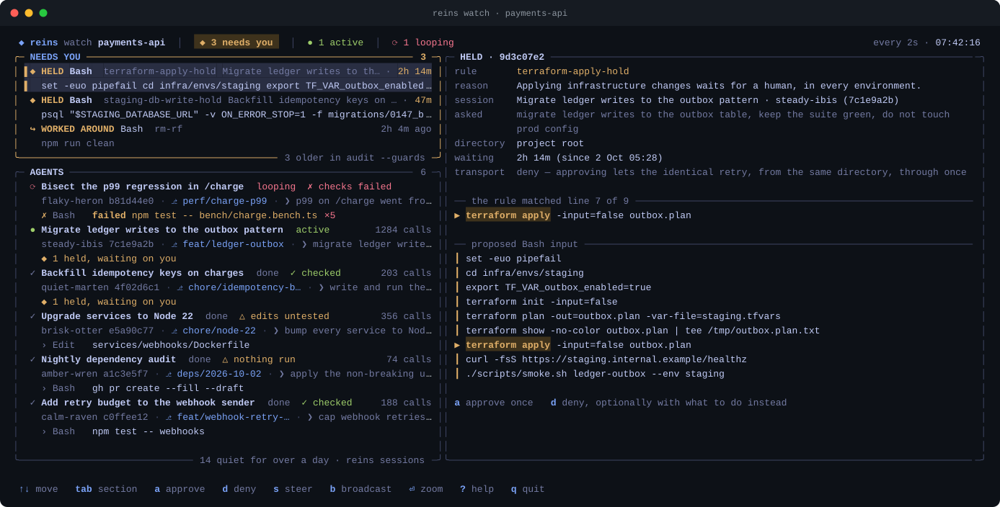
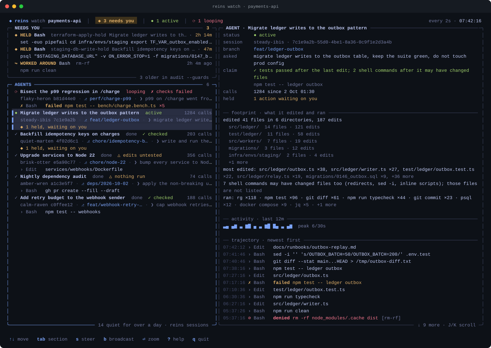
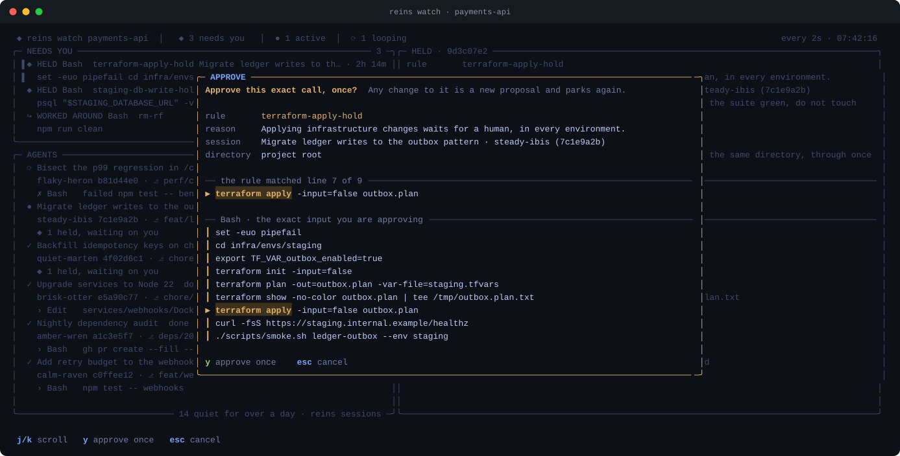

# `reins watch`: the cockpit

`reins sessions` is a snapshot; **`reins watch` is where you run things from.** One screen shows every agent in the repo and everything waiting on you, and it has the controls to answer: approve or deny a held action, and steer one agent or all of them. It's built for the case a built-in queued message can't serve: several agents running and one person watching.

  

The images on this page are rendered by the cockpit's own renderer from a scripted scenario (`assets/cockpit-demo-frame.cjs`), not from real sessions.

- **NEEDS YOU**, top left: every held action, plus hold breaches and worked-around guards from the last 7 days. It reads from `.reins/pending/` and the bypass ledger, so it works without SQLite.
- **AGENTS**, below: each session leads with what it is about, then its live status (`active` / `looping` / `idle` / `done`) and, where the row has room, its call count and a sparkline of its calls over the last 12 minutes. The second line has the name and short id you address it by, its git branch, and the last prompt you sent it. The third has its last call, queued steer, or held action; a call that did not simply run says what happened to it (`failed`, `denied`, `held`, `approved`, `refused`). A session with no title, branch or prompt takes two lines, with its id beside its name. An agent that is not working also carries its [claim check](claim-check.md) verdict beside the status, except "result not visible", which is in the detail pane only: agents pipe test output by habit, and a chip on half the rows says nothing. Status comes from recent tool activity, not the per-turn Stop hook, so an agent mid-conversation reads `active`. `looping` means the same call several times in a row, as the loop alarm counts it. A looping session is listed first, then sessions with a held action, and the rest follow newest first, so on a short terminal the list is cut from the quiet end. A session with no call for over a day is counted in the pane's footer and not listed, unless it is looping, holds an action or has a steer queued; `reins sessions` lists them all. File paths inside the project are shown from the project root.
- **When the terminal is narrow**, text is cut in a fixed order. The header gives up the refresh interval, then the idle count, then the active count. What needs you and the looping count stay. An agent row gives up its sparkline, then its call count, then the end of its title. The status and the verdict stay. A hold row cuts the session title before the rule id. Below 104 columns the detail pane is hidden until you press `⏎`. The minimum is 60×14.

  

- **Detail**, right: for a hold, the rule, reason, session, the prompt that session was last given, directory, transport, and the **full proposed input** with the text the rule matched highlighted. When that text is below the third line of a long command, the matched line is also shown above the input, with its line number, so you do not have to find it. The approve dialog shows the same. The match is found with the guard's own matcher against the rule as it stands now; if the rule was edited or removed since the action parked, nothing is highlighted. Only Bash rules are located this way. A session that proposed a deny-transport hold and has made no call for over a day is said so, since an approval is used only if it retries. For an agent, its branch, last prompt, claim check verdict, footprint, activity and trajectory, newest first. `⏎` zooms it to full screen.

**Where a session's title comes from.** The cockpit, `reins sessions`, `reins pending`, `reins lastrun`, the steer picker and the report all name a session the same way. A name set with `reins name` leads. Otherwise they show the title Claude Code gave the session (the one in its own session list, or the one you set with `/rename`), read from the tail of the session transcript along with the branch and last prompt. Without a transcript the `brave-otter` mnemonic leads, as before. The caveats: the transcript format is not a documented interface, so a Claude Code update can turn titles back into mnemonics until reins catches up. The path is recorded by capture, so titles need SQLite (Node ≥ 22.5), and a session shows its title after its first completed tool call under this version. Claude Code titles a session early, so a long session's title can describe where it started. The last prompt is the current one. The title, branch and prompt are display only. `reins steer` still takes the id, the mnemonic or your custom name, and no guard or hold reads them.

| key | does |
|---|---|
| `↑↓` `j k` · `tab` | move · jump to the next section |
| `a` | approve the selected held action (see below) |
| `d` | deny it, optionally typing what the agent should do instead (sent as steering) |
| `s` · `b` · `c` | steer the selected agent (or the hold's agent) · broadcast to all · clear its queued steer |
| `⏎` · `J K` · `?` · `q` | zoom detail · scroll detail · help · quit |

  

**Approving here is `reins approve`, with two extra checks a keypress needs and a typed command doesn't.** Both go through the same code (`src/holdActions.ts`), so an approval still clears one exact call, once. On top of that:

- **The dialog shows the full input and `y` stays locked until you have scrolled to the end of it.** A 120-line heredoc can't be approved from its first line.
- **The action is re-read at the moment you press `y`.** If it was answered from another terminal, or no longer matches what you reviewed, nothing is approved and the cockpit tells you so.

When a new hold arrives, the header flashes and the terminal bell rings. iTerm2, WezTerm and Ghostty also get a desktop notification. `--quiet` turns off the bell and notification. **The selection never moves on its own**, because a list that reorders under your cursor is how the wrong thing gets approved. Steering from the cockpit appends to what's already queued, like `reins steer`, so a queued nudge is never overwritten.

Text from agent runs (commands, paths, steering, session titles and prompts) is untrusted, and control characters are stripped before it reaches your terminal. Otherwise a command containing escape sequences could set your clipboard or draw over the approve dialog.

Nothing listens on a port: the only way in is the keyboard of whoever started it. That's why approving lives here and not in `reins report`. Tune the refresh with `reins watch -n 1` (seconds). Piped or with `--once`, it prints one plain snapshot, including the `reins approve` / `reins deny` command for each hold, so it works in scripts. No TUI library and no daemon: raw ANSI on the terminal you already have, and it needs at least 60×14.

---

[Back to the README](../README.md)
